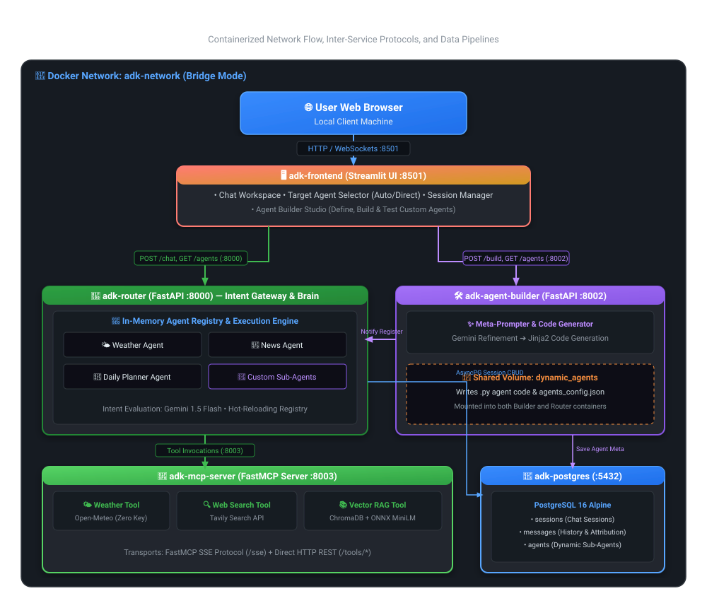

# 🤖 ADK Agent Hub — Multi-Agent System & MCP Tool Server

A production-ready, containerized multi-agent platform powered by **Google ADK / GenAI SDK**, **Gemini Flash**, **Model Context Protocol (MCP)**, **ChromaDB with ONNX Runtime**, **PostgreSQL**, and **Streamlit**.

Optimized for **Local Client Machine** and lightweight container footprints.

---

## 🏛️ System Architecture & Service Connections



### 📊 Visual Topology & Communication Grid

| Tier | Service | Port | Interfaces & Connections | Core Responsibility |
|:---|:---|:---|:---|:---|
| **Frontend** | **🖥️ Streamlit UI** | `:8501` | ➔ `router:8000` (Chat & History)<br/>➔ `agent-builder:8002` (Agent Creator) | User interface for real-time chat, routing target selection, session management, and visual agent builder. |
| **Gateway & Brain** | **🔀 Router Agent** | `:8000` | ➔ `postgres:5432` (Sessions & History)<br/>➔ `mcp-server:8003` (Tools via SSE/HTTP)<br/>🗂️ Reads `/app/dynamic_agents` volume | Analyzes user intent with Gemini Flash, executes smart routing or direct agent mode, and hot-loads custom sub-agents. |
| **Agent Factory** | **🛠️ Agent Builder** | `:8002` | ➔ `postgres:5432` (Agent Metadata)<br/>➔ `router:8000` (Register / Unregister)<br/>🗂️ Writes to `/app/dynamic_agents` volume | Converts natural language specifications into Python sub-agent modules, equips MCP tools, and registers agents instantly. |
| **Tool Provider** | **🧰 MCP Tool Server** | `:8003` | ➔ `chromadb` (ONNX vector store)<br/>➔ Open-Meteo API (Weather)<br/>➔ Tavily API (Web Search) | FastMCP server hosting tools for Weather forecasts, live Web Search, and ONNX-powered local clinical RAG retrieval. |
| **Persistence** | **🐘 PostgreSQL 16** | `:5432` | ⬅️ `router:8000` (AsyncPG Pool)<br/>⬅️ `agent-builder:8002` (AsyncPG Pool) | Alpine database storing chat sessions, complete message history, and custom agent configurations. |
| **Vector Store** | **📚 ChromaDB (ONNX)** | Internal | ⬅️ `mcp-server:8003` (`all-MiniLM-L6-v2`) | Embedded vector database performing cosine similarity search over local domain knowledge bases. |

---

### 🔄 End-to-End Request & Data Lifecycle

```
[ 1. User Query ]
       │
       ▼
[ Streamlit UI (:8501) ]
       │  HTTP POST /chat  { "message": "...", "agent_id": null | "weather" }
       ▼
[ Router Gateway (:8000) ]
       │
       ├─► [ PostgreSQL (:5432) ]  (Store user message in session)
       │
       ├─► Intent Classification (Gemini Flash)
       │         │
       │         ├─► "weather" ──► [ Weather Agent ] ──► [ MCP Server (:8003) ] ──► Open-Meteo API
       │         ├─► "news"    ──► [ News Agent ]    ──► [ MCP Server (:8003) ] ──► Tavily Search API
       │         ├─► "planner" ──► [ Planner Agent ] ──► [ MCP Server (:8003) ] ──► Weather + Schedule
       │         └─► "custom"  ──► [ Custom Agent ]  ──► [ MCP Server (:8003) ] ──► ChromaDB Vector RAG
       │
       ├─► Generate Final Response (Gemini Flash with Tool Context)
       │
       ├─► [ PostgreSQL (:5432) ]  (Store assistant response with agent badge)
       │
       ▼
[ Streamlit UI (:8501) ] ◄── Renders message with Specialist Agent Avatar & Badge
```

---

### ⚡ Dynamic Agent Creation Flow

```
[ User defines Agent in UI ]
       │  Name: "Cardiology Advisor"
       │  Tools: ["rag_query", "web_search"]
       │  Prompt: "You are a cardiology specialist..."
       ▼
[ Agent Builder (:8002) ]
       │
       ├─► 1. Refine Prompt with Gemini Flash
       ├─► 2. Render Python Code via Jinja2 Template
       ├─► 3. Write file to shared volume (/app/dynamic_agents/cardiology_advisor.py)
       ├─► 4. Save metadata to PostgreSQL (agents table)
       ├─► 5. Notify Router Gateway (POST /agents/register)
       │
       ▼
[ Router Gateway (:8000) ] ──► Dynamic Agent instantly active in-memory (< 1s)
       │
       ▼
[ Streamlit UI (:8501) ] ──► Agent appears in sidebar dropdown & is ready for chat!
```

---

## 📦 Service Catalog

| Service | Container Name | Port | Base Image | Description |
|---|---|---|---|---|
| **Streamlit Frontend** | `adk-frontend` | `8501` | `python:3.11-slim` | Interactive web UI with dual-mode navigation (Chat Workspace + Agent Builder Studio), agent selector, and session manager. |
| **Router Agent Gateway** | `adk-router` | `8000` | `python:3.11-slim` | Main routing brain. Analyzes query intent, delegates to specialized sub-agents, manages conversation memory, and syncs with PostgreSQL. |
| **Agent Builder** | `adk-agent-builder` | `8002` | `python:3.11-slim` | Generates sub-agent code from natural language prompts using Gemini & Jinja2, persists configs, and registers them dynamically. |
| **MCP Tool Server** | `adk-mcp-server` | `8003` | `python:3.11-slim` | FastMCP tool server providing Weather (Open-Meteo), Web Search (Tavily), and Vector RAG (ChromaDB + ONNX). |
| **PostgreSQL Database** | `adk-postgres` | `5432` | `postgres:16-alpine` | Persists chat sessions, full message history, and custom agent definitions across restarts. |

---

## ⚙️ Prerequisites & Setup

1. **Prerequisites**:
   - [Docker Desktop](https://www.docker.com/products/docker-desktop/)
   - Google Gemini API Key from [Google AI Studio](https://aistudio.google.com/)
   - *(Optional)* Tavily API Key from [Tavily](https://tavily.com/) for live web search

2. **Configure Environment**:
   ```bash
   cp .env.example .env
   ```
   Open `.env` and fill in your keys:
   ```env
   GOOGLE_API_KEY=AIzaSy...your_google_key_here
   TAVILY_API_KEY=tvly-...your_tavily_key_here     # Optional
   GEMINI_MODEL=gemini-1.5-flash                  # or gemini-3.6-flash
   ```

3. **Start All Services**:
   ```bash
   docker compose up -d --build
   ```

4. **Access the Web UI**:
   Open **[http://localhost:8501](http://localhost:8501)** in your browser.

---

## 🧪 Comprehensive `curl` Testing Suite

You can test every microservice directly from your terminal using these ready-to-run commands:

### 1. Health Checks
```bash
# MCP Tool Server Health
curl -s http://localhost:8003/health | jq .

# Router Gateway Health
curl -s http://localhost:8000/health | jq .

# Agent Builder Health
curl -s http://localhost:8002/health | jq .
```

---

### 2. Testing MCP Tool Server Endpoints (`:8003`)

```bash
# Test 1: Weather Tool (Open-Meteo API, no key required)
curl -s -X POST http://localhost:8003/tools/weather \
  -H "Content-Type: application/json" \
  -d '{"city": "Tokyo"}' | jq .

# Test 2: Vector RAG Query (ChromaDB + ONNX Knowledge Base)
curl -s -X POST http://localhost:8003/tools/rag \
  -H "Content-Type: application/json" \
  -d '{"query": "What are the first line medications for Type 2 Diabetes?", "n_results": 2}' | jq .

# Test 3: Web Search Tool (Tavily API)
curl -s -X POST http://localhost:8003/tools/search \
  -H "Content-Type: application/json" \
  -d '{"query": "James Webb space telescope discoveries", "max_results": 3}' | jq .
```

---

### 3. Testing Router & Chat Routing (`:8000`)

```bash
# Test 1: List all active agents (Built-in + Dynamic)
curl -s http://localhost:8000/agents | jq .

# Test 2: Smart Router Query (Auto-routes to Weather Agent)
curl -s -X POST http://localhost:8000/chat \
  -H "Content-Type: application/json" \
  -d '{"message": "What is the current temperature and wind in Paris?"}' | jq .

# Test 3: Direct Mode Query (Directly target News Agent)
curl -s -X POST http://localhost:8000/chat \
  -H "Content-Type: application/json" \
  -d '{"message": "Recent breakthrough in quantum computing", "agent_id": "news"}' | jq .

# Test 4: Direct Mode Query (Directly target Daily Planner Agent)
curl -s -X POST http://localhost:8000/chat \
  -H "Content-Type: application/json" \
  -d '{"message": "Help me plan my schedule for tomorrow with 3 meetings and a workout", "agent_id": "planner"}' | jq .

# Test 5: List Saved Chat Sessions
curl -s http://localhost:8000/sessions | jq .
```

---

### 4. Testing Dynamic Agent Builder (`:8002`)

```bash
# Test 1: Build & Register a New Custom Medical Agent
curl -s -X POST http://localhost:8002/build \
  -H "Content-Type: application/json" \
  -d '{
    "name": "Medical Advisor",
    "description": "Specializes in clinical guidelines, symptom reviews, and treatment protocols.",
    "prompt": "You are a clinical assistant. Always use rag_query to consult the local medical knowledge base before answering.",
    "tools": ["rag_query", "web_search"]
  }' | jq .

# Test 2: List Custom Built Agents
curl -s http://localhost:8002/agents | jq .

# Test 3: Deactivate / Delete a Custom Agent
curl -s -X DELETE http://localhost:8002/agents/medical_advisor | jq .
```

---

## 🛠️ Best Practices & Operations

### 1. Fast Configuration Updates (No Rebuilding Needed)
When you modify only the `.env` file (e.g., updating API keys or switching models), recreate the containers in seconds without rebuilding:
```bash
docker compose up -d
```

### 2. Complete Project Reset & Clean Start
To clear old containers, build cache, and database volumes:
```bash
docker compose down -v --rmi local
docker compose up -d --build
```

### 3. Gemini Model Selection Guide
- **`gemini-1.5-flash`** *(Recommended)*: Balanced speed, generous free rate limits (15 RPM, 1,500 requests/day).
- **`gemini-1.5-flash-8b`**: Ultra-fast, minimal latency, separate quota bucket.
- **`gemini-3.6-flash`**: Google's latest preview endpoint for advanced reasoning.

### 4. Adding Custom Knowledge to Vector RAG
1. Drop text files into `services/mcp_server/app/vectorstore/data/<category>/your_doc.txt`.
2. Delete the Chroma volume to trigger re-indexing on startup:
   ```bash
   docker volume rm adk-agent-hub_chromadb_data
   docker compose up -d
   ```

### 5. Hardware Optimization
- **Zero PyTorch Overhead**: Embeddings run via `onnxruntime` + `tokenizers` using ARM64 NEON CPU optimizations.
- **Minimal RAM Footprint**: Base image is `python:3.11-slim`, and the PostgreSQL container uses `postgres:16-alpine`, keeping total system idle memory under **~600 MB**.

---

## 📂 Project Directory Structure

```
adk-agent-hub/
├── docker-compose.yml              # 5-service orchestration with health checks & volumes
├── .env.example                    # Environment template
├── README.md                       # Comprehensive documentation
│
├── services/
│   ├── frontend/                   # Streamlit Web Application
│   │   ├── Dockerfile
│   │   ├── requirements.txt
│   │   └── app/
│   │       ├── main.py             # App entrypoint & routing
│   │       ├── components/         # UI components (sidebar, chat, builder)
│   │       └── utils/api_client.py # HTTP client to backend services
│   │
│   ├── router/                     # Router Agent Gateway
│   │   ├── Dockerfile
│   │   ├── requirements.txt
│   │   └── app/
│   │       ├── main.py             # FastAPI REST endpoints
│   │       ├── router_agent.py     # Intent classification & routing engine
│   │       ├── db.py               # AsyncPG PostgreSQL persistence
│   │       └── agents/             # Pre-built agents (Weather, News, Planner, Base)
│   │
│   ├── agent_builder/              # Dynamic Agent Builder Service
│   │   ├── Dockerfile
│   │   ├── requirements.txt
│   │   └── app/
│   │       ├── main.py             # FastAPI build & management API
│   │       ├── builder.py          # Gemini meta-prompter & code generator
│   │       └── templates/          # Jinja2 agent code templates
│   │
│   ├── mcp_server/                 # MCP Tool & Vector RAG Server
│   │   ├── Dockerfile
│   │   ├── requirements.txt
│   │   └── app/
│   │       ├── main.py             # FastMCP SSE & REST entrypoint
│   │       ├── tools/              # Weather, Web Search, RAG tool modules
│   │       └── vectorstore/        # ONNX ChromaDB loader & medical datasets
│   │
│   └── postgres/
│       └── init.sql                # SQL tables schema (sessions, messages, agents)
```
